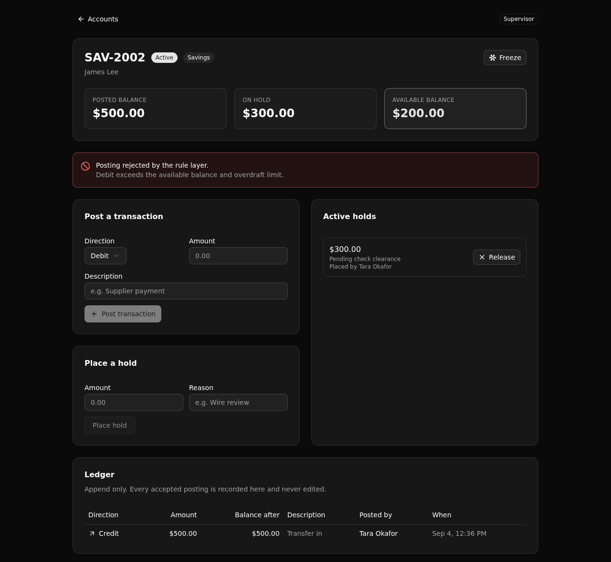

# Deposit Account Servicing Backend

One governed rule layer for a bank's deposit servicing: every debit and credit posts through the same balance, overdraft, hold, and status rules, and lands in an immutable ledger.



**6 tables · 9 APIs · 1 function**

## What it demonstrates

This is a **Backend Modernization** proof (Xano Play 2) for **banking**. It stands in for the servicing slice of a legacy core banking stack: accounts, a posting engine, holds, and a full transaction ledger, with the posting rules living in one readable API layer instead of buried across a monolith.

The one governed job: **post a transaction only if it obeys the account's balance, overdraft, hold, and status rules, then record it immutably.** The posted balance is never edited in place. It moves only when the posting engine appends a matching ledger row, so the ledger is the system of record and the balance is derived from it.

Why a core-servicing modernization architect cares:

- **Every posting rule is in one place.** Status, overdraft, hold-aware available balance, and a supervisor threshold are enforced by a single endpoint, so there is one thing to read and audit, not many copies to reconcile.
- **Available balance is derived, not stored.** It is the posted balance minus the sum of active holds, computed once in a shared function that both the posting rule and the account read call. The number on screen is the number the rule enforces.
- **Access is checked at the API layer.** Roles (teller, supervisor, viewer) gate each endpoint with a precondition on the caller's identity. This is middleware and role based access control, not row level security. A hidden button is still refused when the endpoint is called directly.
- **The ledger is append only.** There is deliberately no endpoint that edits or deletes a transaction row. A rejected posting writes an audit event with the reason and writes no ledger row at all.

## Repo layout

```
xano/
  tables/            users (auth), customers, accounts, transactions, holds, servicing_events
  functions/         account_snapshot — the available-balance rule, defined once
  api/               the API group + nine endpoints
  index.ts           registers everything onto one workspace()
  xano.lock          pinned object identities + the api-group canonical slug
frontend/            React + Vite + Tailwind + shadcn/ui
  src/lib/api.ts     the one contract: paths + types derived from the query defs
docs/                the landing page (GitHub Pages) + the screenshot above
```

## API surface

Every endpoint hangs off one API group with a pinned canonical slug, so the public paths are stable (`/api:servicing/...`).

| Verb | Path | Access | What it enforces |
| --- | --- | --- | --- |
| POST | `/auth/login` | public | Verifies credentials, mints a role scoped token. |
| POST | `/seed` | public | Resets and reloads the demo data. |
| POST | `/accounts/open` | teller, supervisor | Opens an account for a customer, writes an audit event. |
| GET | `/accounts/list` | any signed in role | Lists accounts with their customers. |
| GET | `/account/{account_id}` | any signed in role | One account: derived available balance, ledger, holds, audit trail. |
| POST | `/transactions/post` | teller (supervisor for large debits) | The posting engine: status, overdraft, hold, and role rules. |
| POST | `/holds/place` | teller, supervisor | Places an active hold, lowering available balance. |
| POST | `/holds/release` | supervisor only | Releases a hold, restoring available balance. |
| POST | `/accounts/freeze` | supervisor only | Toggles active and frozen; a frozen account blocks postings. |

Viewers read. Tellers open accounts, post within the threshold, and place holds. Supervisors also post large debits, release holds, and freeze accounts.

## Quick start

Clone it, install, authenticate once, and deploy. The deploy builds the frontend, ships it with the backend to a live ephemeral environment, and prints the URL.

```bash
git clone https://github.com/xano-scratch/deposit-account-servicing-backend.git
cd deposit-account-servicing-backend
npm install
npx xanots login          # once, to authenticate against your Xano account
npm run xano:deploy       # builds the frontend, deploys backend + frontend, prints the live URL
```

The environment starts empty. Open the frontend and click **Reset demo data** on the sign in screen (or `POST /api:servicing/seed`) to load three customers, three accounts, a starter ledger, and one staff account per role.

Demo logins (throwaway ephemeral credentials, not real secrets):

| Role | Email | Password |
| --- | --- | --- |
| Teller | `tara@bank.example` | `teller-demo` |
| Supervisor | `sam@bank.example` | `supervisor-demo` |
| Viewer | `val@bank.example` | `viewer-demo` |

## Try the governed job

1. Sign in as the **teller**, open an account, and post a credit and then a debit. The balance and the ledger update together.
2. Open the savings account with an active hold. Its posted balance is higher than its available balance. Post a debit that fits the posted balance but not the available balance. The rule layer rejects it, and an audit event records why. No ledger row is written.
3. Sign in as the **supervisor**, release the hold, and post the same debit again. Now it fits, because the available balance recovered.
4. Freeze an account as the supervisor. Every posting is then rejected. Unfreeze it and posting works again.
5. Sign in as the **viewer**. You can read the account, the ledger, and the audit trail, but you cannot post, hold, or freeze.

## How it is built

Authored with [`@xanots/sdk`](https://www.npmjs.com/package/@xanots/sdk): typed `table`, `apiGroup`, `defineFunction`, and `query` defs compiled to a Xano workspace and deployed live. The frontend imports those same query defs, so its request paths and its request and response types come from the backend and cannot drift. Rename a def and the frontend stops compiling until it is updated.

## FAQ

**Is this a production system?** No. It is a proof artifact on a throwaway environment, meant to be read and run. The live links in the build notes are ephemeral. The durable artifact is this repo, which anyone can deploy for fresh links.

**Where do the posting rules live?** In `xano/api/transactions_post.ts`, with the available-balance rule shared from `xano/functions/account_snapshot.ts`. That is the whole point: one readable place.

**How is auth handled?** A native Xano auth table plus a token minted at login, with a role check on each endpoint. Access is enforced at the API layer, which is where Xano models it.

**Can I change the demo data?** Yes. Edit `xano/api/seed.ts` and redeploy. A deploy is a full replace, so it reseeds cleanly.
